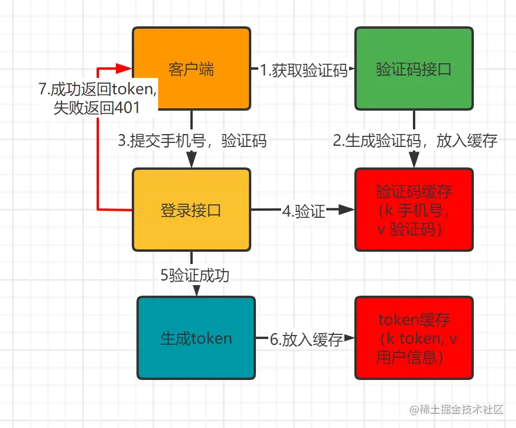
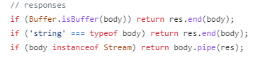
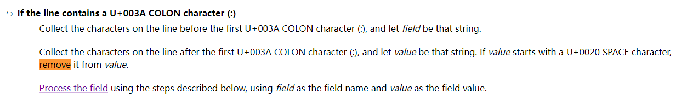
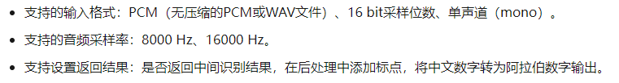

# 智友——一个基于OpenAI ChatGPT的机器人聊天APP


## 项目介绍
✨智友App是一个基于 OpenAI ChatGPT 接口的机器人“智友”问答App，旨在提供陪伴式聊天体验。主要功能包括：

📌基础体验：验证码登录、流式生成回答、中断流式回答、语音输入、收藏问答（TODO）、问题素材（TODO）

📌商业化：穿山甲广告接入（TODO）、看广告获问答次数（TODO）

⛏️技术栈: 
- 前端（Expo, React Hook, Typescript, Expo-Router, React-Native-paper, Axios, SSE, Lottie）
- 后端（Koa, Typescript, Ioredis, Mysql2, Koa-Jwt, @Alicloud）

🔑额外说明：此仓库只包含前端代码，后端代码见[仓库](https://github.com/HITyycc/koa-zhiyou)

## 项目演示
（1）手机号短信验证码登录&emsp;&emsp;&emsp;&emsp;（2）流式生成回答、中断流式回答、联系上下文回答

<span>&emsp;&emsp;&emsp;</span>

(3) 语音实时输入

<span>&emsp;&emsp;&emsp;</span>

## 目录
- [项目介绍](#项目介绍)
- [项目目录结构](#项目目录结构)
- [功能点介绍](#功能点介绍)
- [运行步骤](#运行步骤)

## 项目主要目录结构
```
zhiyou-app
├─app (expo router存放路由页面的文件夹，详见 expo 文档 https://docs.expo.dev/routing/create-pages/)
│  ├─(tabs) (底部Tab导航)
│  │  ├─chatWelcome (聊天室Tab页面)
│  │  ├─me （我的Tab页面）
│  ├─(auth) (登录模块页面)
│  │  ├─welcome (登录欢迎页面)
│  │  ├─getSmsCode (输入电话号码获取验证码页面)
│  │  ├─inputSmsCode (输入验证码页面)
│  ├─chat (聊天模块页面)
│  │  ├─[id] (聊天窗页面)
│  ├─[...missing] (404页面)
├─context (使用React context的状态管理组件)
│  ├─auth (路由鉴权)
│  ├─authAxiosProvider (axios鉴权相关，基于Axios拦截器的，能够自动携带Jwt Token和Token失效Error跳转登录页的Axios实例)
│  ├─authWebsocket.tsx（websocket鉴权相关，和authAxiosProvider同理）
│  ├─chatRoomProvider （单个聊天窗状态Provider）
│  ├─loadingProvider (全局Loading组件)
├─components (自定义组件)
│  ├─chatBox (app/chat/[id] 聊天窗页面用到的组件)
│  │  ├─chatShower （聊天记录显示框组件）
│  │  ├─inputBox （输入框组件）
│  ├─custome (自定义组件)
│  │  ├─me (me Tab中用到的组件)
│  │  │  ├─UserInfo (用户头像、姓名信息组件)
│  │  ├─CustomButton （按钮组件）
│  │  ├─DigitalInput （一位数字输入框，app/(auth)/inputSmsCode中用到的验证码输入框）
│  │  ├─Loading (加载中组件)
│  │  ├─LoadingDots (三点加载中lottie动效)
├─utils (工具函数)
│  ├─store （本地存储工具函数）
│  ├─style （移动端尺寸、字体适配工具函数）
│  ├─utils （通用工具函数）
├─assets (静态文件)
│  ├─fonts (存放字体)
│  ├─git (git仓库中README用到的图片)
│  ├─images (项目中用到的图片)
│  ├─lottiefiles (存放Json格式的lottie动效，详见 https://lottiefiles.com/featured?utm_medium=web&utm_source=navigation-featured)
├─constants (一些常量)
├─typing (一些用typescript定义的类型声明)
```

## 功能点介绍

### 移动端布局和字体大小适配

前端的任务之一是在拿到UI设计稿后在移动端按照稿子上的效果展现出来，由于移动端设备的尺寸、字体大小不一，需要考虑移动端尺寸的布局适配问题。

#### 布局适配

- 统一封装一个计算真实绝对值大小的函数 pTx(x) [utils/style中]，基于$\frac{真实绝对值大小}{设备宽度}==\frac{UI稿中大小}{UI稿中设备宽度}$得到$真实绝对值大小==\frac{UI稿中大小}{UI稿中设备宽度}\cdot设备宽度$，这样在指定元素大小时调用该函数，直接输入设计稿上的尺寸大小就可以直接按比例在设备上完美复现UI稿效果。

- 遇到的坑——为什么不用宽度百分比：一是麻烦，需要计算所有父子元素之间的宽度百分比，不如直接使用稿子中的尺寸按比例计算绝对值。二是在设置图片大小的时候，无法设置高度，图片自己缩放会出现莫名的空白区域，不便控制效果，而使用pTx可以确定好图片大小，无需让图片自己缩放。

#### 字体大小适配

- 统一封装一个函数 scalefontSize(x) [utils/style中]根据所需比例计算真实绝对值大小，绝对值大小=14×设备字体缩放大小×所需比例。

- 同时解决的问题：由于RN中没有em单位，当设定元素字体大小为scalefontSize(x)时，想要实现元素三行高，可以使用scalefontSize(3*x)

### 登录与鉴权

#### 登录

1. 验证码登录：使用随机数生成4位验证码；基于redis存储和验证验证码；使用阿里云sms服务发送验证码；登录验证成功后生成Jwt-Token作为身份凭证。具体流程参考如下：

<span>&emsp;&emsp;&emsp;</span>

2. 验证码安全：在使用redis存储的时候设置验证码存储有效期，促使用户尽快验证；在获取验证码的频率上做了一分钟只能获取一次的限制，避免验证码滥发；在前端向手机号发送验证码时基于正则对手机号有效性做了初步验证；

3. 身份凭证：使用Jwt-Token生成带有用户信息的身份凭证，存储用户Id、用户名称和头像链接。 

4. 四位验证码输入框UI：每一位数字使用一个输入框组件，使用 useRef 生成输入框的ref数组统一管理四位输入框，以实现四个输入框之间的联动，包括第一个输入框的自动获得焦点、四位验证码输入完成后自动提交验证、当前输入框输入完成后焦点自动到下一个输入框、在空输入框按下退格键自动回退到前一个输入框。

5. 遇到的困难点：在使用setTimeout实现倒计时60秒后显示可重发验证码按钮的功能时，应用切换到后台后定时器会停止计时，导致倒计时不准确。可用两个方案解决该问题，一是后台运行倒计时任务，二是基于系统时间更新倒计时时间。考虑到倒计时是展示给用户看的，在后台运行这个计时任务没有必要，因此采用方案二。

#### 鉴权

- 前端鉴权是指根据用户身份（登录或未登录）以授予其能够访问的内容，包括页面路由相关、对于需要登录态的Api在头部携带上Token和请求401错误处理。

1. 页面路由相关：保护需要登录状态的路由页面，对于未登录或登录过期自动跳转登录页。其实现思路是使用Context Provider存储用户登录状态 [context/auth]，并将整个路由作为Consumer，在Provider中监听路由和用户登录态变化，在路由变化时根据当前登录态和该路由是否被保护而决定是否要跳转到登录页。

2. 对于需要登录态的Api在头部携带上Token和请求401错误处理：本项目主要使用axios发起请求，头部携带上Token和请求401错误处理都是通用的，为避免重复编写，在Context Provider创建了Axios实例，基于Axios拦截器在发送前携带上Token，在错误处理中遇到401错误就自动跳转到登录页。这样想要访问需要登录状态的组件就可以直接作为Context consumer使用这个Axios实例发请求。

- 后端鉴权是指根据用户身份（登录或未登录）以授予其能够访问的Api。

1. 在需要保护的api路由前增加jwt-token中间件验证token的有效性。


### 聊天模块

#### 流式回答

为了给用户提供即时性的体现，采用流式响应的方式返回回答。

- 后端相关

1. 由于Koa官方文档中不让使用res.write和res.end方法，所以不能使用这两个函数来传递流式数据。

2. 后端转发：流式响应需要使用Server-Sent-Event(sse)技术接收chatgpt api的流式数据并转发给前端，主要过程是创建Passthrough对象，为其绑定监听事件进行数据的转发。此处选择转发而不是直接在前端请求chatgpt api是因为请求chatgpt api需要openapi的密钥，为了避免密钥在前端暴露，所以选择转发的方式。

3. 遇到的坑：在koa中实现该接口时是使用异步函数去实现的，最初是指定完ctx.res.setHeader("Content-Type", "text/event-stream;charset=utf-8")后就交给异步函数去执行，但发现这样的方式在接口函数同步代码执行结束后整个连接就断开了。

    通过查阅koa中对res.body的处理源码[koagit链接](https://github.com/koajs/koa/blob/6e1093be27b41135c8e67fce108743d54e9cab67/lib/application.js#L220)可以知道，如下图所示，当koa发现res.body是Stream类型才不会断开连接，当res.body非Stream类型时，并不是根据头部的Content-Type来判断执行完接口函数后是否要断开连接。所以保证接口函数同步代码执行完Passthrough对象向res.body的赋值。

<span>&emsp;&emsp;&emsp;</span>

- 前端相关

1. 用到的库：由于移动端不能使用axios和fetch接收流数据，所以需要安装react-native-sse来接收后端的流式数据。

2. 清除副作用：每次用户点击发送消息后会创建一个EventSource对象，通过为其绑定监听事件接收流数据，需要注意退出页面和发送新消息时前一个EventSource对象监听事件的清除（使用React中的useEffect实现）。sse中的连接需要靠客户端主动断开，所以需要注意退出页面和接收完数据后客户端的主动断开连接。

3. 遇到的坑一：sse中发送数据有特定的格式，即"data: 想要发送的数据\n\n"，但是当数据的开头是空格时，前端接收到的数据中的开头空格会被吞掉。根据 [sse data format](https://html.spec.whatwg.org/multipage/server-sent-events.html#dispatchMessage) 中介绍，清除数据开头的空格是规范。所以可以自定义发送数据规范来避免这个坑，最后通过设定"data: #想要发送的数据\n\n"这个格式解决这个问题。

<span>&emsp;&emsp;&emsp;</span>

#### 聊天窗

聊天窗主要由三个模块实现

- chatRoomProvider：基于Context和Reduce负责单个会话的状态管理，状态包括聊天记录、加载状态、聊天窗和输入框组件的ref（方便两个组件联动）等

- 聊天记录组件：负责聊天记录的显示
1. 遇到的坑一：聊天记录使用滑动窗组件包裹，在想要实现当聊天记录有新增消息时，滑动窗自动划到底部这个功能时，但是滑动窗的划到底部的函数需要新消息成功加入到状态后并渲染到页面调用才能划到新消息的底部，所以无法在使用dispatch添加后立马调用这个函数。后来根据事件循环机制，可以在dispatch后使用setTimeout 0秒后执行划到底部的函数就可以保证在渲染完才执行。

2. 遇到的坑二：在想要实现键盘出现时整个聊天窗口向上移，使用KeyboardAvoidingView包裹整个聊天窗可以随着键盘的出现和消失变化大小，但是当键盘出现后，效果上输入框上移了但是聊天记录并没有上移。经检查，原来是滑动窗高度是变了，但是相对整个滑动窗的滑动位置没有发生变化，所以需要在键盘出现后改变滑动位置到底部。同样需要保证滑动窗尺寸变化渲染完成后后再调用滑动到底部的函数，最后通过ScrollView的onLayout事件实现了这个效果。

- 输入框组件：负责用户输入

#### 实时语音转文字

为了更方便用户的输入，本应用还支持实时语音转文字的输入方式，用户可以边语音输入边查看转换结果。想要实现这个功能，需要客户端和服务端双向数据传输，因此采用websocket协议。

- 后端相关

1. websocket服务：
    koa可以使用koa-websocket在原来的服务基础上搭建websocket服务器
    ```js 
    import websockify from "koa-websocket"
    const app = websockify(new Koa())
    ```
    上述初始化完成后使用app.ws来指代websocket服务，app.ws和app的中间件和路由相互独立。
    websocket的通信过程为tcp三次握手 + http协议升级到websocket（返回101升级成功后代表websocket连接成功建立） + 数据传输 + websocket双方断开连接 + tcp四次挥手
    
    其中websocket的连接建立由koa自动完成，建立完成后会执行中间件和路由函数。中间件用于
    websocket的预配置、路由函数用于配置websocket事件的绑定。

2. websocket服务鉴权：服务的鉴权和http服务同理，客户端在创建websocket时需要携带登录Token，并实现一个中间件使用koa-jwt来对登录Token进行验证。在前端部分，和authAxios类似，为了避免关于websocket服务登陆权限代码的重新编写，同样使用React.context实现了登录token的自动携带和未授权时的跳转登录页。

3. 阿里实时语音转文字服务与配置： 此处使用的是[阿里云实时语音转文字服务](https://help.aliyun.com/document_detail/84428.html?spm=a2c4g.173522.0.0.5b0f5398On3vtt)，其中需要注意服务的配置。

<span>&emsp;&emsp;&emsp;</span>

本项目中选择PCM文件和16000HZ的音频采样率，后面在前端进行录音配置时需要根据这个进行配置。

- 前端相关

1. 授权与录音配置（以ios为例子）：
在录音前需要使用Audio.requestPermissionsAsync()来请求授权。
下面是录音的配置，如果不和阿里服务中的相匹配，就会无法识别。
```js
const quality: Audio.RecordingOptions = JSON.parse(JSON.stringify(Audio.RecordingOptionsPresets.LOW_QUALITY))
quality.ios.sampleRate = 16000 // 采样率
quality.ios.extension = ".pcm" // 文件格式
quality.ios.numberOfChannels = 1  // 声道
```

2. 音量泡泡：在录音开始时可以配置每隔一段时间的录音状态检测，其中onRecordingStatusUpdate中的status的metering表示录音的音量（-160~0），可以根据这个指标设置音量泡泡的大小。
```js
 static createAsync = async (
    options: RecordingOptions = RecordingOptionsPresets.LOW_QUALITY,
    onRecordingStatusUpdate: ((status: RecordingStatus) => void) | null = null,
    progressUpdateIntervalMillis: number | null = null
  ): Promise<RecordingObject>
```

其中泡泡使用Lottie动画，为了泡泡大小变化衔接地更加丝滑，使用Animated库控制大小的变化。

3. 录音文件的发送：同样使用onRecordingStatusUpdate的事件，在该事件中读取录音临时文件片段，由于文件的读取只有在base64格式下才能截取所需片段，所以使用base64格式读取，读取后就发送到服务端。

4. 遇到的坑：在客户端使用base64格式读取临时录音文件，读取后是字符串格式，但使用websocket的send接口发送时服务端却已ASCII码格式接收。导致数据错误（如A在base64中应该是0b000000，但以Ascii码格式读取却是0b1000001。所以在发送的时候需要将base64格式的字符串转成二进制格式发送。

### 其他

#### 全局加载组件

在写代码的时候需要实现“加载中”的效果，而很多页面都需要这个效果，所以想实现以一个全局的加载组件。其实现思路是实现一个Context Provider [context/loadingProvider]，用于控制加载中组件是否显示，并且为应用页面开放其控制接口；为了加载中组件能够覆盖在页面之上，将其使用Portal包裹。

#### 防止mysql注入

在koa中构造mysql语句时，为防止mysql注入，采用mysql2.query中？和参数列表的方式构造，可以自动转义特殊字符，如：
```
const queryString: string = `INSERT INTO userConversations (user_id) values (?);`;
await ctx.mysql.query(queryString, [id]);
  ```

## 运行步骤

### 下载前端、后端代码和Docker（用于运行mysql和redis服务）

```
// expo前端项目
git clone https://github.com/HITyycc/zhiyouApp.git
cd zhiyouApp
npm install
cd ..

// koa后端项目
git clone https://github.com/HITyycc/koa-zhiyou.git
cd koa-zhiyou
npm install
```
安装 [Docker Desktop] (https://www.docker.com/products/docker-desktop/) 

```
docker pull mysql:latest
docker pull redis:latest

 // 运行mysql容器，其中声明了管理员root的密码为123456
docker run -itd --name mysql-zhiyou -p 3306:3306 -e MYSQL_ROOT_PASSWORD=123456 mysql

// 运行redis容器
docker run -itd --name redis-zhiyou -p 6379:6379 redis
```

### 阿里云sms和openai接口服务申请

- [阿里云sms短信服务](https://cn.aliyun.com/product/sms)申请：参考官方文档，并申请sms接口服务的AccessKey和AccessSecret（这里选择阿里云是因为阿里云可以给不上线的应用程序提供sms服务）

- openAI ChatGPT api：申请一个ChatGPT账号后，进入[openai-ChatGPT官网](https://openai.com/chatgpt)，登录后在个人主页创建[API key](https://platform.openai.com/account/api-keys)

### mysql数据库创建

- 创建数据库

```sql
CREATE DATABASE zhiyouDb;
USE zhiyouDb;
```
- 创建对zhiyouDb可有管理权限的账号

```sql
CREATE USER 'zhiyouManager'@'localhost' IDENTIFIED BY '123456';
GRANT ALL PRIVILEGES ON `zhiyouDb`.* TO 'zhiyouManager'@'localhost';
FLUSH PRIVILEGES;
```

- 创建用户信息表

| 字段 | 备注 | 类型 | 可否为空 | 键 |
| ------- | ------- | ------- | ------- | ------- |
|user_id (自增)|用户的唯一id标识|int|no|PRI|
|nickname|用户昵称（限制15个字符）|varchar(60)|no||
|avatar_url|头像地址|varchar(500)|yes||
|phone_number|绑定的电话号码|varchar(20)|no||
|created_at|创建时间|timestamp|no||
|updated_at|更新时间|timestamp|no||

```sql
CREATE TABLE IF NOT EXISTS `user`(
   `user_id` INT UNSIGNED AUTO_INCREMENT,
   `nickname` VARCHAR(60) NOT NULL,
   `avatar_url` VARCHAR(500),
   `phone_number` VARCHAR(20) NOT NULL,
   `create_at` DATETIME NOT NULL,
   `updated_at` DATETIME NOT NULL,
   PRIMARY KEY ( `user_id` )
)ENGINE=InnoDB DEFAULT CHARSET=utf8;

CREATE INDEX idx_phone_number ON user(phone_number);
```
 
 - 创建聊天记录表

| 字段 | 备注 | 类型 | 可否为空 | 键 |
| ------- | ------- | ------- | ------- | ------- |
|conversion_id|用户拥有的会话id数组|BIGINT|no|PRI|
|conversion_content|会话的内容，由包含role和content字段的如（{"role":“system”, content: "你是一个机器人"}）组成的以逗号分割的字符串|LONGTEXT|yes|
|titile|标题|varchar(60)|yes||
|user_id|用户的唯一id标识|int|no||
|created_at|创建时间|timestamp|no||
|updated_at|更新时间|timestamp|no|||

 ```sql
 CREATE TABLE IF NOT EXISTS `userConversations`(
   `conversation_id` BIGINT UNSIGNED AUTO_INCREMENT,
   `user_id` INT UNSIGNED,
   `conversation_content` LONGTEXT,
   `title` varChar(60),
   `create_at` DATETIME NOT NULL,
   `updated_at` DATETIME NOT NULL,
   PRIMARY KEY ( `conversation_id` )
)ENGINE=InnoDB DEFAULT CHARSET=utf8;
// 插入后自动更新create_at和update_at字段
DELIMITER //
CREATE TRIGGER userConversationsInsert BEFORE INSERT ON userConversations
FOR EACH ROW
BEGIN
    SET NEW.create_at = NOW();
    SET NEW.updated_at = NOW();
    SET NEW.conversation_content='{"role":"system","content":"You need to be friendly and keep your answers within about 20 words each."}';
END //
DELIMITER;
// 更新后自动更新updated_at字段
CREATE TRIGGER userConversationsUpdatedTime BEFORE UPDATE ON userConversations
FOR EACH ROW SET NEW.updated_at = NOW();
 ```

### 后端配置
- koa后端项目参数设置，进到koa-zhiyou根目录，创建config文件夹，并在新建的config文件夹中分别创建default.json、development.json和production.json。在default.json和production.json中输入{}，在default.json中输入如下配置：
```json
{
    "smsAccess": {
        "AccessKey": "阿里云sms短信服务的AccessKey",
        "AccessSecret": "阿里云sms短信服务的AccessSecret",
        "loginTemplateCode": "阿里云sms短信服务的短信模板",
        "signName": "阿里云sms短信服务的签名",
        "expireTimeSecond": 300, // 验证码在redis中的过期时间，300s
        "reGetTime": 60  // 可重新获取验证码的时间间隔
    },
    "aliSr": {
        "url": "wss://nls-gateway.cn-shanghai.aliyuncs.com/ws/v1",
        "AccessKey": "实时语音转文字的AccessKey",
        "AccessSecret": "实时语音转文字的AccessSecret",
        "endpoint": "http://nls-meta.cn-shanghai.aliyuncs.com",
        "apiVersion": "2019-02-28",
        "appkey": "实时语音转文字的appkey"
    },
    "redis": {
        "port": 6379, // redis容器端口
        "host": "localhost" // redis容器ip
    },
    "mysql": {
        "port": 3306, // mysql容器端口
        "host": "localhost", // mysql容器ip
        "user": "root", // mysql服务用户名
        "password": "123456", // mysql服务密码
        "database": "zhiyouDb" // 访问的数据库
    },
    "jwt": {
        "secret": "balabala" // jwt-token的秘钥
    },
    "openai": {
        "openKey": "sk-s4iy9ouvrdYAVX2P1uWeT3BlXXXXXXXXXXXXXXXXXX" // openai的秘钥
    }
}

```

### 最终运行

进入到zhiyouApp

```bash
npm run start
```

进入到koa-zhiyou
```bash
npm run dev:watch
```
 
